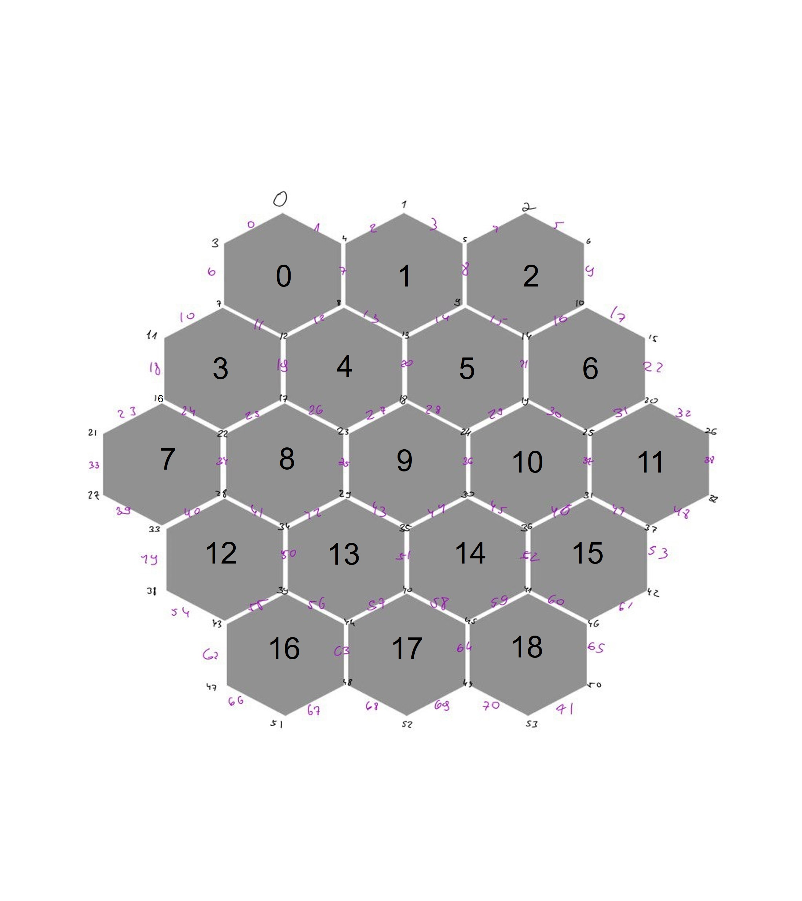

# CPP_EX3_24 - Catan

## Author
- [Noam Cohen]
- Email: Noam12345002@gmail.com

## Catan - the game

The whole game is played through the terminal and depends on inputs(INT) from the user

In addition, a picture of the board is attached GUI

my game is similar to the original game but in a simpler version for example

The game is played between 3 players 

all the project written in C++

### game logic
In the begining the `Catan` activates the functions:
1.`order_resources(game_board)` 
2.`order_number(game_board)`
3.`order_turns(p1, p2, p3)`
4.`start_game(game_board)`
5.`during_game(p1, p2, p3, game_board)`

In the first round each player taking turns (determined at random)

And there are 2 villages and 2 roads

At the end of the turns, resources are distributed to the players according to the location of the villages

by `start_game(game_board)` function

in most rounds each player in turn is given choices by `during_game(p1, p2, p3, game_board)` function

### Main Classes

- `Catan` - This class manages all aspects of the game, including the game state, player turns, and interactions between the various components of the game such as the board, players, and cards.

- `Board` - Represents the game board with 19 Hexagon.

- `Player` - Represents a participant in the game. This class manages the player's resources, development cards, and settlements. It also handles actions a player can take, such as building roads or cities, buying development cards, and trading.

- `Hexagon` - Represents a single hexagonal tile on the game board. Each hexagon has a resource type and produces resources for surrounding settlements when its number is rolled.
because shorts classes Edge and Vertex and Hexagon in `Hexagon.cpp` file.

### Board structure
The board is made of 19 hexagons

Each hexagon is made up of 6 vertices and 6 sides

the class are at `Hexagon.cpp`:
1.`Hexagon`
2.`Edge`- a edge holds the two vertices of which it is a part
3.`Vertex` - a vertex holds the edges (2 or 3) of which it is a part

All board members are numbered with a unique number(ID)

According to my decision and the whole game is based on these decisions

there are six resources: WOOD , WHITE_STONE , RED_STONE , SHEEP , HAY and DESERT.

in start game each hexagon randomly receives a resource and a number 

randomly by `rand()` and `srand()` functions.

### Tests
My code was checked with many tests in `Test.cpp` with the `make test` command.
and `make valgrind` To check for memory leaks.

### type of gui 

there is picture of board in `Board.jpj`
and during the game, emojis are used for pleasant use

The Board:

### Development cards - inheritance

The father's department is `DevCard.hpp`

and there are five Development cards that represent by Inheriting classes
1.`knight`- add one to knight field of Player 
2.`Monopoly` - The player is asked to choose one resource and it is taken from the rest of the other players.
3.`Road_Building`- The player is asked to choose there are places on the board to build roads.
4.`Victory_Point`- add one to points field of Player
5.`Year_Of_Plenty`- The player is asked to choose  two resource that he wants to receive.

### Integrity checks

The game is played by asking the user to enter ints according to the options shown on the screen.

The tests are carried on the uput by while's , border checks and `readValidInt()` function for check INT input

